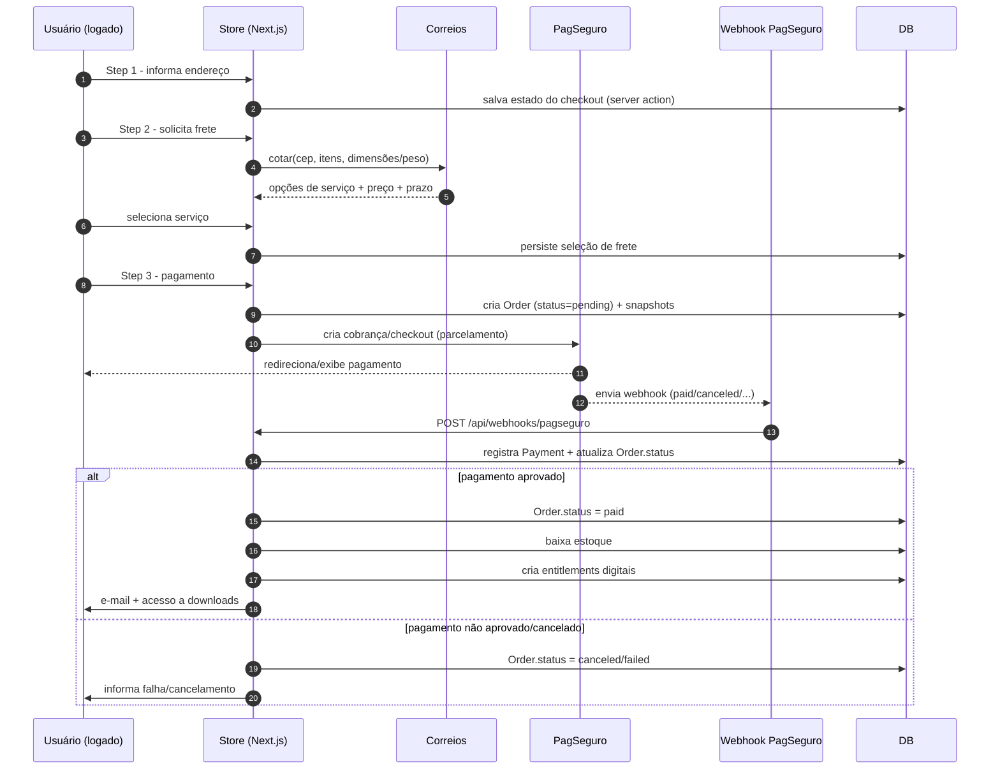
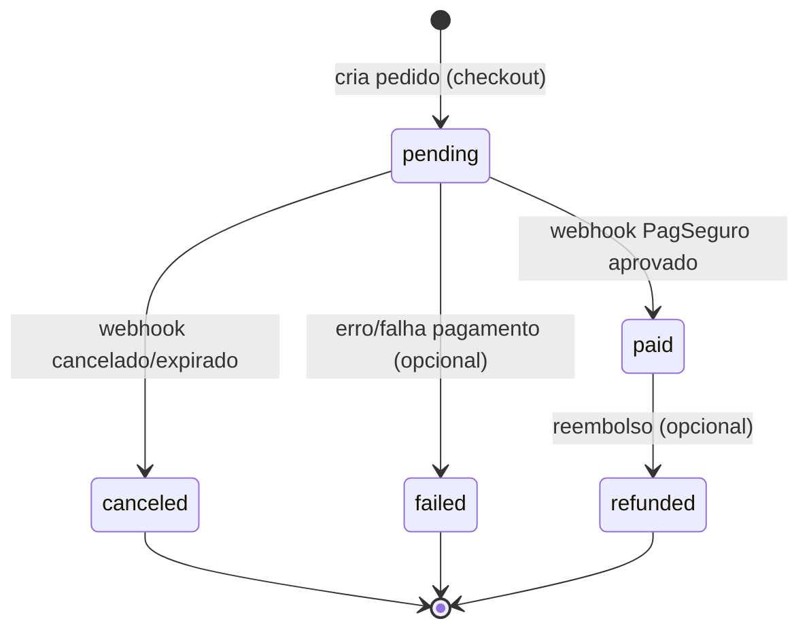
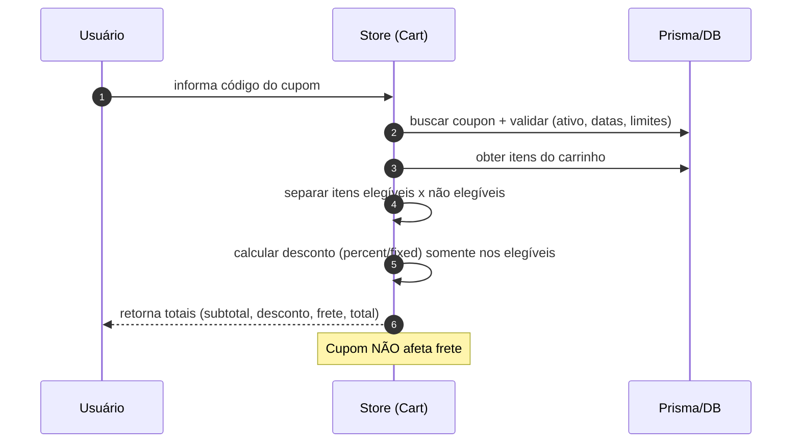
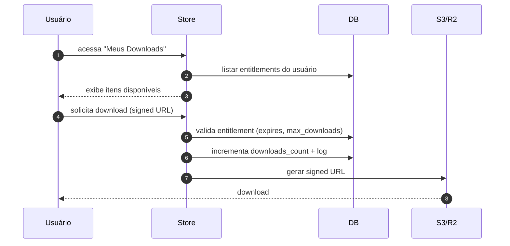
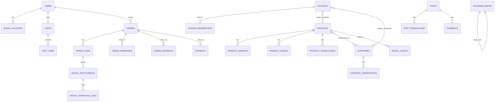

# nb-store — Diagramas (MVP, Next.js)

Data: **2025-12-18**  
Projeto: **nb-store (Next.js)**  
Stack: **Next.js 14 + TypeScript + Bootstrap + Prisma + MySQL** (Vercel; storage S3/R2; route handlers; cron via Vercel)

Domínios:
- Produção: Loja `https://nobugs.com.br` | Admin `https://admin.nobugs.com.br` | API opcional `https://api.nobugs.com.br`
- Dev: Loja `http://localhost:3000` | Admin `http://admin.localhost:3000`

Decisões-chave:
- **Sessões separadas** (loja vs admin)
- Checkout multi-etapas
- Estoque: `pending` **não reserva**, baixa somente em `paid`
- Cupons por produto/categoria, **não** afetam frete
- PagSeguro com parcelamento; **juros pagos pelo cliente**
- Digital: assets privados (S3/R2) com **links assinados**
- Idiomas: pt-BR/en-US; Moedas: BRL base + USD conversão diária
- Discord gating por produto/categoria (guild + role)

---

## 1) Context Diagram (C4 — Nível 1)

```mermaid
flowchart LR
  U[Cliente / Usuário] -->|Navega, compra, baixa digitais| STORE[Loja (Next.js)]
  A[Administrador] -->|Gerencia catálogo, pedidos, conteúdo| ADMIN[Admin (Next.js)]

  STORE -->|Checkout/Payment| PAG[PagSeguro]
  PAG -->|Webhook (status pagamento)| API[/api/webhooks/pagseguro]

  STORE -->|Cotação frete| COR[Correios API]
  STORE -->|OAuth / verificação de guild/role| DIS[Discord API]

  STORE --> DB[(MySQL/Postgres via Prisma)]
  ADMIN --> DB

  STORE --> FS[(Storage privado S3/R2)]
  ADMIN --> FS

  STORE --> MAIL[Email Provider]
  ADMIN --> MAIL
```

---

## 2) Containers (C4 — Nível 2)

```mermaid
flowchart TB
  subgraph NEXT[Next.js 14 (App Router)]
    STOREWEB[Store Web (React/SSR/ISR)
    Segmento: app/(store)]
    ADMINWEB[Admin Web (React/SSR)
    Segmento: app/(admin)]
    API[Route Handlers /api/*
    webhooks, auth, APIs]
    JOBS[Cron/Workers
    (Vercel Cron + fila opcional)]
    SERVICES[Server Modules
    Payments/Shipping/Discord/Pricing/FX]
    DBLAYER[Prisma Client]
  end

  STOREWEB --> SERVICES
  ADMINWEB --> SERVICES
  API --> SERVICES
  SERVICES --> DB[(MySQL/Postgres)]
  SERVICES --> FS[(S3/R2)]
  SERVICES --> PAG[PagSeguro]
  SERVICES --> COR[Correios API]
  SERVICES --> DIS[Discord API]
  SERVICES --> MAIL[Email Provider]
```

Notas:
- Store/Admin compartilham código, separados por segmentos/hosts.
- Lógica sensível reside em server modules/route handlers (não no client).

---

## 3) Fluxo de Checkout (multi-etapas)



---

## 4) Máquina de Estados do Pedido



Regras:
- `pending`: **não** baixa estoque
- `paid`: baixa estoque e libera digitais

---

## 5) Cupom — cálculo



---

## 6) Entrega Digital (Entitlements + Downloads)



---

## 7) Discord Gating — checagem

```mermaid
flowchart LR
  U[Usuário] --> OAUTH[Conectar Discord (OAuth)]
  OAUTH --> SA[(social_accounts)]
  U --> CHECK[Checagem de gating]
  CHECK -->|sem conta Discord| BLOCK[Bloqueia\npedir para conectar]
  CHECK -->|com conta| DIS[Discord API]
  DIS -->|membro + role ok| OK[Permitir compra/download]
  DIS -->|falha| BLOCK2[Bloquear\nmostrar instrução]
```

---

## 8) RBAC + Níveis (Admin)

```mermaid
flowchart TB
  A[Admin User] --> UR[user_role]
  UR --> R[roles\n(level, is_admin)]
  R --> RP[role_permission]
  RP --> P[permissions]

  A --> POL[Guards/Policies]
  POL -->|valida permission + level| ALLOW[Permite ação]
  POL -->|nega| DENY[403]
```

“Invisibilidade”: usuário só lista/edita usuários com `level <= meu_level`.

---

## 9) Multi-idioma e Multi-moeda (pt-BR/en-US, BRL/USD)

```mermaid
flowchart TB
  REQ[Request] --> LOC[Middleware Locale]
  LOC --> CUR[Currency Resolver]
  CUR --> VIEW[UI]
  VIEW --> FX[Exchange Rate]
  FX --> DB[(exchange_rates)]
  JOB[FetchExchangeRateJob (diário)] --> FXAPI[FX Provider API]
  FXAPI --> DB
```

Moeda:
- Preço base: BRL
- USD exibido por conversão usando taxa diária; salvar `fx_rate_used` no pedido.

---

## 10) Webhooks PagSeguro — idempotência

```mermaid
flowchart TB
  IN[POST /api/webhooks/pagseguro] --> PARSE[Validar assinatura + payload]
  PARSE --> FIND[Buscar Payment por provider_reference]
  FIND -->|existe e status já aplicado| STOP[No-op (idempotente)]
  FIND -->|novo| SAVE[Salvar Payment payload]
  SAVE --> UPDATE[Atualizar Order.status]
  UPDATE --> EFFECTS[Efeitos: baixa estoque, entitlements, e-mails]
```

---

## 11) ER (núcleo MVP)



---

## 12) Notas de implementação
- Checkout: server actions em `app/(store)/checkout/*` chamando serviços.
- Orders/Payments: `src/server/payments/*`, `app/api/webhooks/pagseguro/route.ts`.
- Shipping: `src/server/shipping/*`.
- Coupons/Pricing: `src/server/pricing/*`.
- Digital: `src/server/digital/*`, signed URLs do S3.
- Discord: `src/server/discord/*`.
- RBAC: `src/server/auth/rbac/*` + guards em server actions.
- i18n: `middleware.ts` + `next-intl`.
