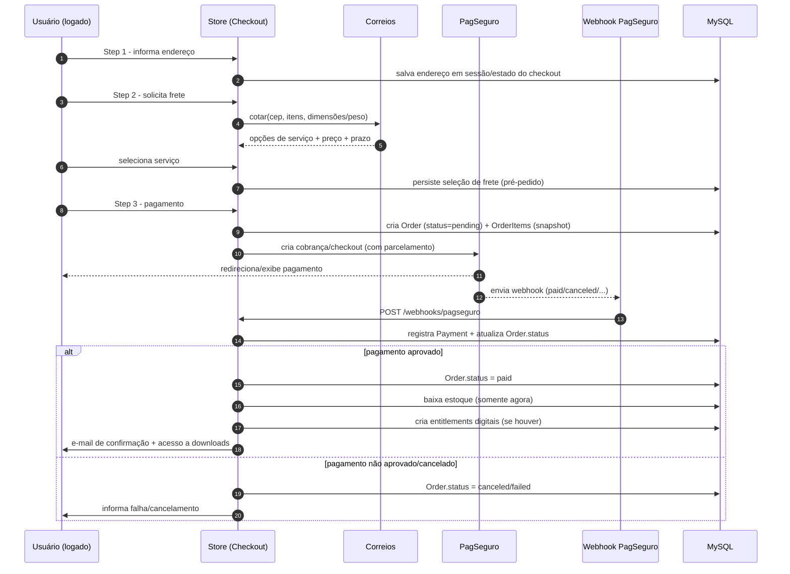
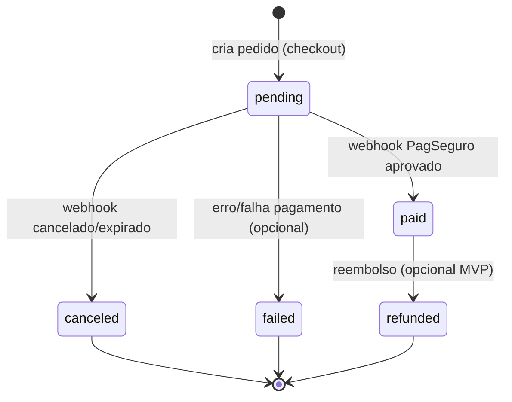
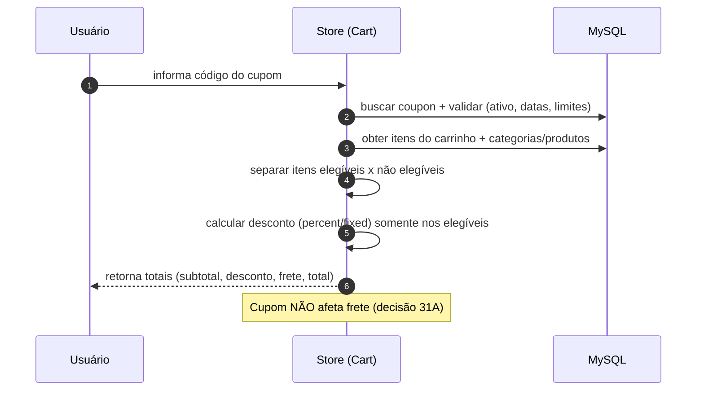
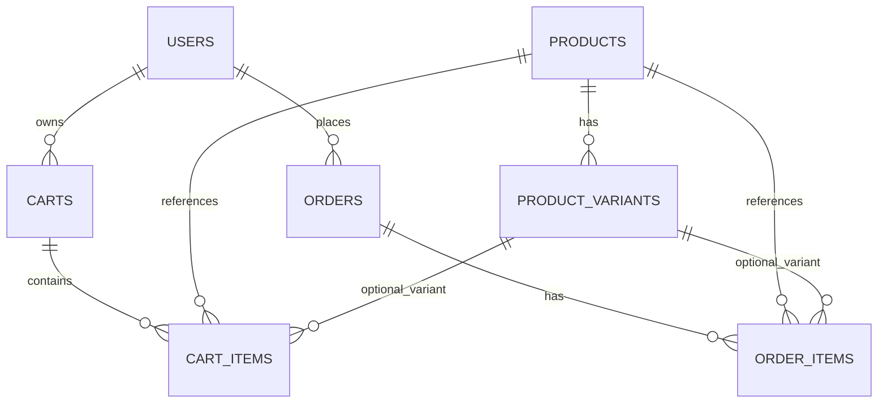
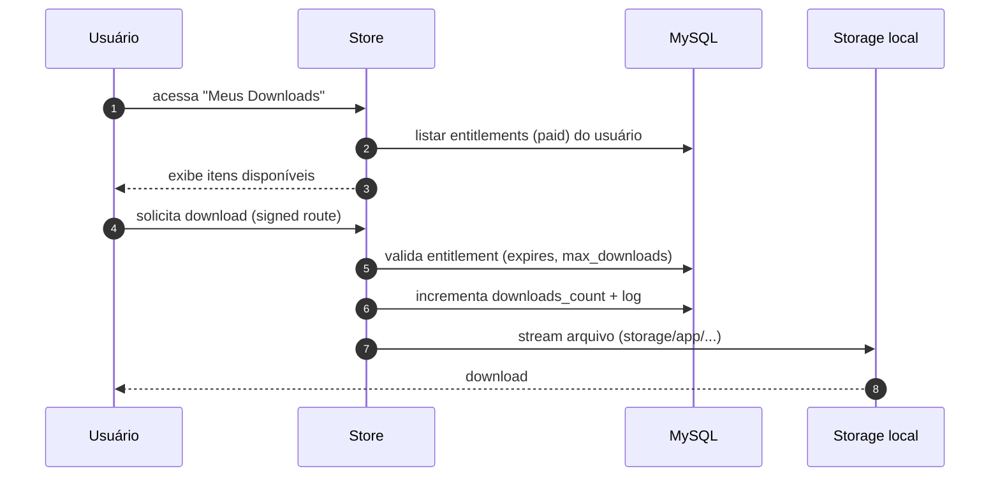
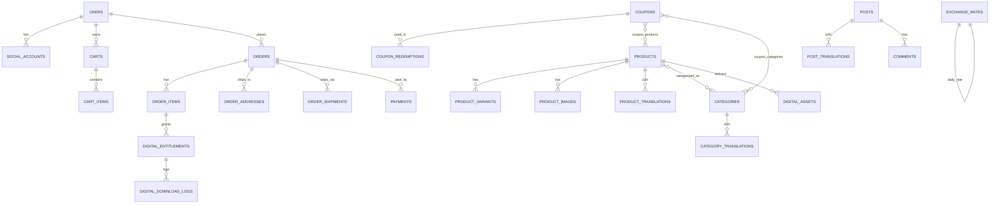

# nb-store — Diagramas (MVP)

Data: **2025-12-16**  
Projeto: **nb-store (NoBugs Store)**  
Stack: **Laravel 11 + Blade + Bootstrap + MySQL** (Hostinger Shared; deploy FTP; queue database)

Domínios:
- Produção: Loja `https://nobugs.com.br` | Admin `https://admin.nobugs.com.br` | API opcional `https://api.nobugs.com.br`
- Dev: Loja `https://localhost` | Admin `https://admin.localhost` | API opcional `https://api.localhost`

Decisões-chave:
- **Sessões separadas** (loja vs admin)
- Checkout multi-etapas
- Estoque: `pending` **não reserva**, baixa somente em `paid`
- Cupons por produto/categoria, **não** afetam frete
- PagSeguro com parcelamento; **juros pagos pelo cliente**
- Digital: arquivos locais (`storage/app`) com **links assinados**
- Idiomas: pt-BR/en-US; Moedas: BRL base + USD conversão diária
- Discord gating por produto/categoria (guild + role)

---

## 1) Context Diagram (C4 — Nível 1)

```mermaid
flowchart LR
  U[Cliente / Usuário] -->|Navega, compra, baixa digitais| STORE[Loja (nobugs.com.br)]
  A[Administrador] -->|Gerencia catálogo, pedidos, conteúdo| ADMIN[Admin (admin.nobugs.com.br)]

  STORE -->|Checkout/Payment| PAG[PagSeguro]
  PAG -->|Webhook (status pagamento)| STORE

  STORE -->|Cotação frete| COR[Correios API]
  STORE -->|OAuth / verificação de guild/role| DIS[Discord API]

  STORE --> DB[(MySQL)]
  ADMIN --> DB

  STORE --> FS[(Storage local /public e storage/app)]
  ADMIN --> FS

  STORE --> MAIL[SMTP Hostinger]
  ADMIN --> MAIL
```

---

## 2) Containers (C4 — Nível 2)

```mermaid
flowchart TB
  subgraph LARAVEL[Laravel 11 Monólito]
    STOREWEB[Store Web (Blade)\nRoutes: routes/web.php]
    ADMINWEB[Admin Web (Blade)\nRoutes: routes/admin.php]
    WEBHOOKS[Webhooks\nRoutes: routes/web.php (/webhooks/*)]
    JOBS[Queue & Scheduler\n(database queue + cron schedule)]
    SERVICES[Services\nPayments/Shipping/Discord/FX/Pricing]
    MODELS[Models + Policies]
  end

  STOREWEB --> MODELS
  ADMINWEB --> MODELS
  WEBHOOKS --> SERVICES
  JOBS --> SERVICES
  MODELS --> DB[(MySQL)]
  SERVICES --> DB
  SERVICES --> FS[(Storage local)]
  SERVICES --> PAG[PagSeguro]
  SERVICES --> COR[Correios API]
  SERVICES --> DIS[Discord API]
  SERVICES --> MAIL[SMTP Hostinger]
```

Notas:
- Loja e Admin compartilham banco e base de código, mas são separados por **rotas, middleware e views**.
- Sessões/cookies são separados por subdomínio (config por ambiente).

---

## 3) Fluxo de Checkout (multi-etapas)

```mermaid
sequenceDiagram
  autonumber
  participant U as Usuário (logado)
  participant S as Store (Checkout)
  participant C as Correios
  participant P as PagSeguro
  participant W as Webhook PagSeguro
  participant DB as MySQL

  U->>S: Step 1 - informa endereço
  S->>DB: salva endereço em sessão/estado do checkout

  U->>S: Step 2 - solicita frete
  S->>C: cotar(cep, itens, dimensões/peso)
  C-->>S: opções de serviço + preço + prazo
  U->>S: seleciona serviço
  S->>DB: persiste seleção de frete (pré-pedido)

  U->>S: Step 3 - pagamento
  S->>DB: cria Order (status=pending) + OrderItems (snapshot)
  S->>P: cria cobrança/checkout (com parcelamento)
  P-->>U: redireciona/exibe pagamento

  P-->>W: envia webhook (paid/canceled/...)
  W->>S: POST /webhooks/pagseguro
  S->>DB: registra Payment + atualiza Order.status

  alt pagamento aprovado
    S->>DB: Order.status = paid
    S->>DB: baixa estoque (somente agora)
    S->>DB: cria entitlements digitais (se houver)
    S->>U: e-mail de confirmação + acesso a downloads
  else pagamento não aprovado/cancelado
    S->>DB: Order.status = canceled/failed
    S->>U: informa falha/cancelamento
  end
```

---

## 4) Máquina de Estados do Pedido (Order State)

```mermaid
stateDiagram-v2
  [*] --> pending: cria pedido (checkout)
  pending --> paid: webhook PagSeguro aprovado
  pending --> canceled: webhook cancelado/expirado
  pending --> failed: erro/falha pagamento (opcional)

  paid --> refunded: reembolso (opcional MVP)
  canceled --> [*]
  failed --> [*]
  refunded --> [*]
```

Regras:
- `pending`: **não** baixa estoque
- `paid`: baixa estoque e libera digitais

---

## 5) Cupom (restrito por produto/categoria) — cálculo

### 5.1 Fluxo de aplicação do cupom no carrinho

```mermaid
sequenceDiagram
  autonumber
  participant U as Usuário
  participant S as Store (Cart)
  participant DB as MySQL

  U->>S: informa código do cupom
  S->>DB: buscar coupon + validar (ativo, datas, limites)
  S->>DB: obter itens do carrinho + categorias/produtos
  S->>S: separar itens elegíveis x não elegíveis
  S->>S: calcular desconto (percent/fixed) somente nos elegíveis
  S-->>U: retorna totais (subtotal, desconto, frete, total)

  Note over S: Cupom NÃO afeta frete (decisão 31A)
```

### 5.2 Algoritmo de rateio (alto nível)
- Defina `eligible_subtotal = sum(item_total dos itens elegíveis)`
- Se fixed: `discount_total = min(fixed_value, eligible_subtotal)`
- Se percent: `discount_total = round(eligible_subtotal * percent/100)`
- Rateie por item proporcional ao `item_total / eligible_subtotal`
- Guarde snapshot no `order_items.discount_*_snapshot`

---

## 6) Variações (Product Variants) — relação e uso no carrinho/pedido

```mermaid
erDiagram
  PRODUCTS ||--o{ PRODUCT_VARIANTS : has
  USERS ||--o{ CARTS : owns
  CARTS ||--o{ CART_ITEMS : contains
  PRODUCTS ||--o{ CART_ITEMS : references
  PRODUCT_VARIANTS ||--o{ CART_ITEMS : optional_variant

  USERS ||--o{ ORDERS : places
  ORDERS ||--o{ ORDER_ITEMS : has
  PRODUCTS ||--o{ ORDER_ITEMS : references
  PRODUCT_VARIANTS ||--o{ ORDER_ITEMS : optional_variant
```

Regra:
- Carrinho e Pedido devem salvar **snapshots** (nome/preço) para evitar mudança retroativa.

---

## 7) Estoque (sem reserva em pending)

```mermaid
flowchart TB
  ADD[Adicionar ao carrinho] --> CART[Carrinho]
  CART --> CHECKOUT[Checkout cria Order pending]
  CHECKOUT -->|pending| PEND[Pedido pendente (não baixa estoque)]

  PEND -->|Webhook paid| PAID[Pedido pago]
  PAID --> DEC[Decrementa estoque\n(variant ou produto)]
  PAID --> DONE[Entrega física/digital]
```

Observação:
- Pode haver risco de oversell em estoque baixo. No MVP, aceitar risco ou implementar validação no momento do `paid`.

---

## 8) Entrega Digital (Entitlements + Downloads)

```mermaid
sequenceDiagram
  autonumber
  participant U as Usuário
  participant S as Store
  participant DB as MySQL
  participant FS as Storage local

  U->>S: acessa "Meus Downloads"
  S->>DB: listar entitlements (paid) do usuário
  S-->>U: exibe itens disponíveis

  U->>S: solicita download (signed route)
  S->>DB: valida entitlement (expires, max_downloads)
  S->>DB: incrementa downloads_count + log
  S->>FS: stream arquivo (storage/app/...)
  FS-->>U: download
```

---

## 9) Discord Gating (guild + role) — checagem

```mermaid
flowchart LR
  U[Usuário] --> OAUTH[Conectar Discord (OAuth)]
  OAUTH --> SA[(social_accounts)]
  U --> CHECK[Checagem de gating]
  CHECK -->|sem conta Discord| BLOCK[Bloqueia\npedir para conectar]
  CHECK -->|com conta| DIS[Discord API]
  DIS -->|membro + role ok| OK[Permitir compra/download]
  DIS -->|falha| BLOCK2[Bloquear\nmostrar instrução]
```

Recomendação MVP:
- Checar gating **no checkout** e **no download** (defesa em profundidade).

---

## 10) RBAC + Níveis (Admin) — visão

```mermaid
flowchart TB
  A[Admin User] --> UR[user_role]
  UR --> R[roles\n(level, is_admin)]
  R --> RP[role_permission]
  RP --> P[permissions]

  A --> POL[Policies/Middleware]
  POL -->|valida permission + level| ALLOW[Permite ação]
  POL -->|nega| DENY[Nega/403]
```

“Invisibilidade” (níveis):
- Usuário só consegue listar/alterar usuários com `level <= meu_level` (regra a ser implementada em policies/queries).

---

## 11) Multi-idioma e Multi-moeda (pt-BR/en-US, BRL/USD)

```mermaid
flowchart TB
  REQ[Request] --> LOC[SetLocale Middleware]
  LOC --> CUR[SetCurrency Middleware]
  CUR --> VIEW[Views/Prices]
  VIEW --> FX[Exchange Rate]
  FX --> DB[(exchange_rates)]
  JOB[FetchExchangeRateJob (diário)] --> FXAPI[FX Provider API]
  FXAPI --> DB
```

Moeda:
- Preço base: BRL
- Exibição USD:
  - `usd = brl / rate` (definir arredondamento)
  - salvar `fx_rate_used` no pedido no momento do checkout

---

## 12) Webhooks PagSeguro — idempotência (recomendação)

```mermaid
flowchart TB
  IN[POST /webhooks/pagseguro] --> PARSE[Parse + validate assinatura se houver]
  PARSE --> FIND[Buscar Payment por provider_reference]
  FIND -->|existe e status já aplicado| STOP[No-op (idempotente)]
  FIND -->|novo| SAVE[Salvar Payment payload]
  SAVE --> UPDATE[Atualizar Order.status]
  UPDATE --> EFFECTS[Efeitos colaterais:\n- baixa estoque\n- cria entitlements\n- envia e-mails]
```

Implementar “efeitos colaterais” com transação e guardas.

---

## 13) Diagramas ER (núcleo MVP)

```mermaid
erDiagram
  USERS ||--o{ SOCIAL_ACCOUNTS : has
  USERS ||--o{ CARTS : owns
  CARTS ||--o{ CART_ITEMS : contains
  USERS ||--o{ ORDERS : places
  ORDERS ||--o{ ORDER_ITEMS : has
  ORDERS ||--o{ ORDER_ADDRESSES : ships_to
  ORDERS ||--o{ ORDER_SHIPMENTS : ships_via
  ORDERS ||--o{ PAYMENTS : paid_by

  PRODUCTS ||--o{ PRODUCT_VARIANTS : has
  PRODUCTS ||--o{ PRODUCT_IMAGES : has
  PRODUCTS ||--o{ PRODUCT_TRANSLATIONS : i18n
  CATEGORIES ||--o{ CATEGORY_TRANSLATIONS : i18n

  PRODUCTS }o--o{ CATEGORIES : categorized_as

  COUPONS ||--o{ COUPON_REDEMPTIONS : used_in
  COUPONS }o--o{ PRODUCTS : coupon_products
  COUPONS }o--o{ CATEGORIES : coupon_categories

  ORDER_ITEMS ||--o{ DIGITAL_ENTITLEMENTS : grants
  DIGITAL_ENTITLEMENTS ||--o{ DIGITAL_DOWNLOAD_LOGS : logs
  PRODUCTS ||--o{ DIGITAL_ASSETS : delivers

  POSTS ||--o{ POST_TRANSLATIONS : i18n
  POSTS ||--o{ COMMENTS : has

  EXCHANGE_RATES ||--|| EXCHANGE_RATES : daily_rate
```

> Nota: a relação `PRODUCTS <-> CATEGORIES` pode ser pivot (`category_product`) se o produto puder estar em múltiplas categorias.

---

## 14) Notas de implementação (onde cada diagrama “mora” no código)
Sugestão de paths:
- Checkout: `app/Http/Controllers/Store/Checkout/*`
- Orders/Payments: `app/Models/Order.php`, `app/Models/Payment.php`, `app/Services/Payments/*`
- Webhooks: `app/Http/Controllers/Webhooks/PagSeguroWebhookController.php`
- Correios: `app/Services/Shipping/*`
- Coupons: `app/Services/Pricing/*`
- Digital: `app/Models/DigitalEntitlement.php`, `app/Http/Controllers/Store/DownloadsController.php`
- Discord: `app/Services/Discord/*`
- RBAC: `app/Policies/*`, `app/Models/Role.php`, `app/Models/Permission.php`
- i18n: `app/Http/Middleware/SetLocale.php` + translations tables

---

Copilot is powered by AI, so mistakes are possible. Leave a comment via the 👍 👎 to share your feedback and help improve the experience.